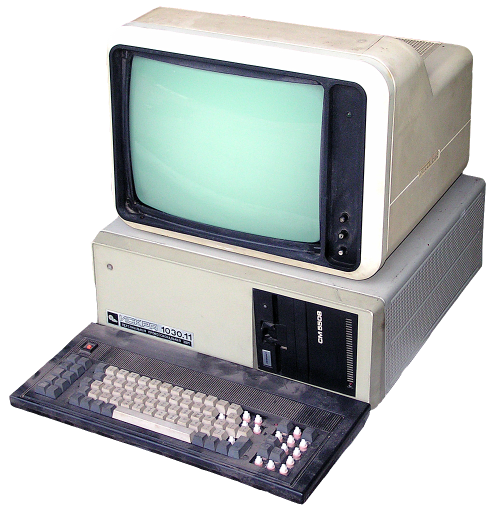

Re-decentralize!

 * Chris McCormick
 * chris@mccormick.cx
 * @mccrmx

???

Hi, my name is Chris and I'm here to talk about Bugout, which is a piece of software for re-decentralizing the web.

---

# Demo

---

# The characters

### Users

run software

### Developers

write software

### Administrators

install software

???

Before we talk about the why of Bugout let's talk about three basic types of computer user.

There is some overlap amongst these three groups obviously.

Developers are people like you and me, who write code.

Users are people who run code on their computers.

Server nerds are people who deploy code and get it running.

An idea behind Bugout is to make the first and last set of people the same again.

---

# A Brief History

Of ordinary people running software on computers.

???

In the old days to run software you would find an "exe" file, install or load it onto your computer, and then run it. This was quite an open and democratic system. Anybody could download an exe file from anybody else onto their computer and install and run it.

With the advent of the app stores this became a curated experience: a "walled garden". Software is installed from a pre-set repository onto the device and then easily run by tapping to open it. Curiously this mirrors the distribution of Free and Open Source software where repositories are used.

The web has an even more complex model for running software. As with mobile apps the software is "run" easily by typing a URL into the URL bar. Installation is very different on the web and requires technical knowledge and usually a financial investment in infratructure.

The modern web is clearly divided into two categories of software: client-side browser code, and server-side code running on a VPS somewhere. Getting software running client-side is easy: just type the URL into the URL bar. Getting software to run on a server is significantly more difficult.

This has a centralizing effect on the internet. A much smaller set of people is able to deploy software onto servers than those who are able to run software in browsers. Most ordinary people can type a URL but they do not know how to use SSH, configure a service, or install an SSL certificate.

The peer-to-peer technology WebRTC allows browsers to talk to eachother directly over the internet. This talk is about using WebRTC to let people easily run their own servers. This talk is about running servers inside browser tabs.

The trend here is that "run the software" becomes more democratic, but "install the software" becomes less democratic.

---

# The web model

Centralization:

 * DNS
 * HTTPS
 * VPS

???

---

# Bugout vs. centralization

  * Client-server over WebRTC instead of HTTPS.
  * Running servers inside browser tabs.

---

# Bugout architecture

 * Built on WebTorrent.
 * WSS torrent trackers for signalling.
 * Peer-to-peer communications.
 * NaCl cryptography.
 * Bitcoin-style addressing.

---

# Howto

How to write your own Bugout service.

---

# Bugout box

A decentralized service appliance.

