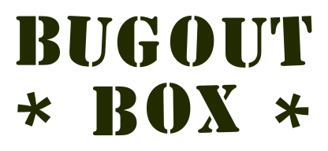

Re-decentralize!

### Chris McCormick
### chris@mccormick.cx
### @mccrmx
### github.com/chr15m

https://github.com/chr15m/bugout

???

Hi, my name is Chris and I'm here to talk about Bugout, which is a piece of software for re-decentralizing the web.

The main idea behind Bugout is to run web services inside browser tabs, which anybody can do, rather than on VPS servers, which only a small set of technical elites can do.

---

# Demo

???

https://chr15m.github.io/bugout/examples/messageboard-server.html

Because the idea of running a server inside a browser tab is quite a strange one I thought I'd start out by showing you how this works in practice.

That will give you some context for the rest of this talk.

Once I open this link you will a server boot up.

The server is not running on a VPS somewhere but instead it is running inside a browser tab.

The way you can reach this server is over WebRTC.

Scan the QR code to access it.

---

# The characters

### Users

run software

### Developers

write software

### Administrators

install software

???

Before we talk about the why of Bugout let's talk about three basic types of computer user.

There is some overlap amongst these three groups obviously. I'm guessing most people here belong to all three of these categories.

Developers are people like you and me, who write code.

Users are people who run code on their computers.

Server nerds are people who deploy code and get it running.

An idea behind Bugout is to make the first and last set of people the same again.

---

# A Brief History

Of ordinary people running software on computers.

???

In the old days to run software you would find an "exe" file, install or load it onto your computer, and then run it. This was quite an open and democratic system. Anybody could download an exe file from anybody else onto their computer and install and run it.

With the advent of the app stores this became a curated experience: a "walled garden". Software is installed from a pre-set repository onto the device and then easily run by tapping to open it. Curiously this mirrors the distribution of Free and Open Source software where repositories are used.

The web has an even more complex model for running software. As with mobile apps the software is "run" easily by typing a URL into the URL bar. Installation is very different on the web and requires technical knowledge and usually a financial investment in infratructure.

The modern web is clearly divided into two categories of software: client-side browser code, and server-side code running on a VPS somewhere. Getting software running client-side is easy: just type the URL into the URL bar. Getting software to run on a server is significantly more difficult.

This has a centralizing effect on the internet. A much smaller set of people is able to deploy software onto servers than those who are able to run software in browsers. Most ordinary people can type a URL but they do not know how to use SSH, configure a service, or install an SSL certificate.

The peer-to-peer technology WebRTC allows browsers to talk to eachother directly over the internet. This talk is about using WebRTC to let people easily run their own servers. This talk is about running servers inside browser tabs.

---

# The web model

Centralization pressures:

 * DNS
 * HTTPS
 * VPS

Not "trust-minimized".

???

What are the things that make it difficult for an ordinary person to install web based software?

DNS is somewhat decentralized but registering a domain name is non trivial and you really need a domain name to run web based software.

A domain name is required because HTTPS is required in almost all modern web systems. Ubiquitous encryption is good but HTTPS encryption uses a "certificate authority" model which is itself quite centralized and prone to error.

Finally to run the server side component of the software requires access to a VPS. Most people barely know what a VPS is let alone how to SSH into a VPS and configure it and install the software.

---

# PHP?

Many many problems, but quite democratic.

???

For all of it's many problems, PHP was quite a democratic web platform.

PHP had good documentation and the install process was "upload files to server" which was quite easy. PHP was popular in an era when HTTPS was not required and getting a VPS and domain name with .

---

# The trend

### Run software

Becomes easier and easier.

???

The act of running software is becoming easier and easier. Anybody can do it. More democratic.

---

# The trend

### Install software

Becomes harder and harder.

???

The act of installing the software becomes harder and harder. Only tech elite can do it. Less democratic.

---

# Trust-minimization

> Practically all of these [web server] machines have architectures ... controlled by ... people who know and trust each other. From the point of view of a remote web or app user, these architectures are based on full trust in an unknown "root" administrator, who can control everything that happens on the server: they can read, alter, delete, or block any data on that computer at will.

Nick Szabo, The dawn of trustworthy computing.

---

# Bugout vs. centralization

  * Client-server over WebRTC.
  * Servers inside browser tabs.
  * Run by you, or somebody you trust.

---

# Bugout architecture

 * Built on WebTorrent.
 * WSS torrent trackers for signalling.
 * Peer-to-peer communications.
 * NaCl cryptography.
 * Bitcoin-style addressing.

---

# Howto

How to write your own Bugout service.

---

A decentralized service appliance.

